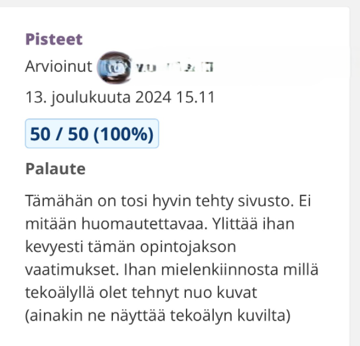

# Responsiivinen ja käyttäjäystävällinen monisivuinen nettisivu projekti

## Sivusto tarjoaa potentiaaliselle lukijalle tietoa yrityksestä, sen tarjoamista palveluista sekä asiantuntijatiimistä. 

Ominaisuudet:
- Navigointivalikko: Selkeä ja käyttäjäystävällinen sivuston rakenne, joka mahdollistaa nopean pääsyn eri osioihin kuten palvelut, suunnittelijat ja yhteydenotto.
- Kuvagalleria: Esittelee yrityksen tiimiä ja asiantuntijoita visuaalisesti houkuttelevalla tavalla.
- Videot: Tarjoaa asiakkaille sneak peek -videoita ja lisätietoja yrityksen tarjoamista palveluista.
- Yhteydenottolomake: Mahdollistaa kävijöiden ottaa yhteyttä suoraan yritykseen.

Sivusto on suunniteltu responsiiviseksi ja käyttäjäystävälliseksi, tarjoten selkeän rakenteen ja visuaalisesti miellyttävän kokemuksen. Tämä projekti on esimerkkini modernista web-suunnittelusta, jossa käytetään HTML5:ttä, CSS:ää ja JavaScriptiä. Tavoitteena on esitellä yrityksen palvelut ja tiimi sekä tarjota helppo pääsy lisätietoihin yhteydenottojen ja palveluiden esittelyjen kautta.

Projekti on toteutettu osana Web-kehitys kurssia ja alla opettajan arvostelu sivustosta:

** Sivun kuvat on luotu OpenAi:n ChatGPT o1-minillä.

